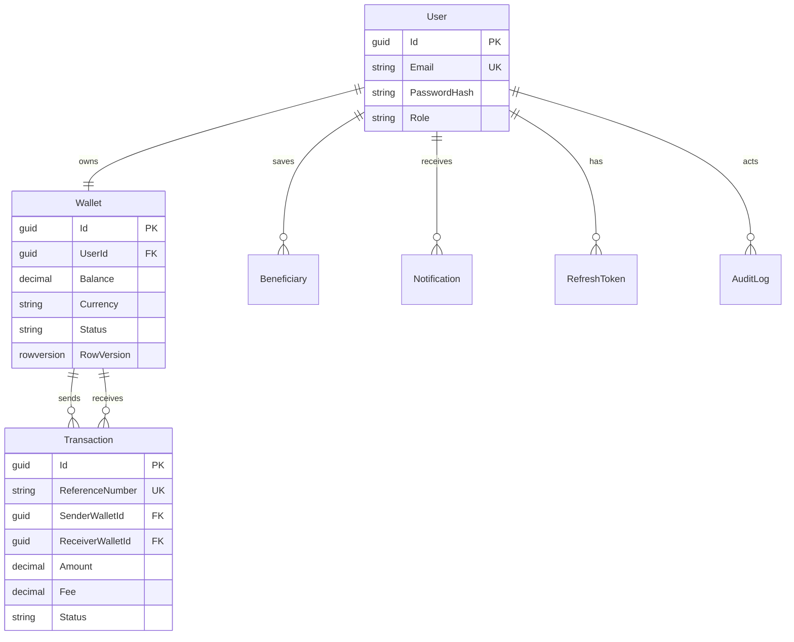

# PayFlow

**Enterprise-style Digital Wallet & P2P Payments platform** — a portfolio project that demonstrates senior backend engineering: Clean Architecture, CQRS, secure auth, atomic money movement, testing, Docker, and CI/CD.

> **Status:** Actively built milestone-by-milestone. See [Implementation status](#implementation-status) for what is done vs planned.  
> **Intent:** Not a production fintech deployment — designed *as if* it could evolve into one.

---

## Why this project exists

Recruiters and hiring managers often see CRUD tutorials. PayFlow is meant to show how I think about **money-moving systems**:

- Clear bounded responsibilities (Clean Architecture)
- Commands vs queries (CQRS)
- Atomic transfers with auditability
- Security baselines (JWT + refresh tokens, password hashing, RBAC)
- Operability (Serilog, ProblemDetails, Docker, GitHub Actions)
- Evidence via tests, docs, and incremental delivery

---

## Product overview

PayFlow lets registered users:

| Capability | Description |
|---|---|
| **Accounts** | Register, login, verify email (mock), reset password (mock) |
| **Wallet** | One wallet per user; balance, status, freeze/activate |
| **P2P Transfer** | Send money to another user with strict validation + atomicity |
| **History** | Paginated, filterable transaction history |
| **Beneficiaries** | Save frequent recipients; prevent duplicates |
| **Notifications** | In-app notification store (SignalR/push later) |
| **Audit** | Immutable-style logs for security-sensitive actions |

---

## Salient features (what to look for in a review)

1. **Clean Architecture dependency rules** — Domain has zero project references; Application never references EF Core.
2. **CQRS with MediatR** — write paths as commands, read paths as queries; thin controllers.
3. **Transfer engine as a first-class concern** — not “update two rows”; validation, atomicity, reference numbers, side effects (audit + notification).
4. **Auth that mirrors real APIs** — short-lived JWT access tokens + refresh token rotation patterns.
5. **API discipline** — versioning, pagination/filtering/sorting, ProblemDetails, Swagger.
6. **Test pyramid** — unit tests for business rules; integration tests for API + persistence.
7. **DevOps literacy** — Docker Compose (API + SQL + Angular), GitHub Actions restore/build/test/publish.
8. **Honest documentation** — architecture tradeoffs, feature specs, and a clear roadmap.

---

## Technology stack

| Layer | Technologies |
|---|---|
| API | ASP.NET Core 10, C# 14 |
| Architecture | Clean Architecture, CQRS, MediatR, FluentValidation |
| Data | EF Core (Code First), SQL Server, Migrations |
| Auth | JWT, Refresh Tokens, Role-based authorization |
| Logging | Serilog |
| Frontend | Angular 20, Angular Material, Signals, standalone components |
| Quality | xUnit, FluentAssertions, unit + integration tests |
| Platform | Docker, Docker Compose, GitHub Actions |

---

## Solution structure

```text
PayFlow/
├── src/
│   ├── PayFlow.Api              # HTTP composition root, controllers, middleware
│   ├── PayFlow.Application      # Use cases (commands/queries), validators, interfaces
│   ├── PayFlow.Domain           # Entities, enums, domain rules (no infra deps)
│   ├── PayFlow.Infrastructure   # EF Core, SQL Server, external implementations
│   └── PayFlow.Shared           # Cross-cutting primitives (keep thin)
├── tests/
│   ├── PayFlow.Tests.Unit
│   └── PayFlow.Tests.Integration
├── docs/                        # Feature & architecture documentation
├── docker/                      # Docker assets (added in Milestone 1)
└── PayFlow.sln
```

### Dependency rule (non-negotiable)

```text
Api ──► Application ──► Domain
 │           ▲
 │           │
 └────► Infrastructure (implements Application interfaces)
```

- **Domain** depends on nothing in this solution.
- **Application** depends on Domain (+ thin Shared), never on EF Core.
- **Infrastructure** implements persistence/auth/email adapters.
- **Api** wires DI and stays thin.

---

## Architecture tradeoffs (decisions recruiters can probe)

These are deliberate choices — not defaults.

| Decision | Chosen approach | Alternatives considered | Why this choice |
|---|---|---|---|
| Architecture style | Clean Architecture + CQRS | Vertical slices only; traditional N-tier | Best signal of maintainability + clear test boundaries for a portfolio |
| Identity | Custom user model + JWT/refresh | ASP.NET Identity; external IdP | Explains security end-to-end; notes that real fintech uses dedicated IAM |
| Money storage | `decimal(18,2)` + currency code | Integer minor units (cents) | Pragmatic with EF; document minor-units as production hardening path |
| Wallet provisioning | Same DB transaction as registration | Domain events / outbox | Correct and simple for monolith; designed so outbox can be added later |
| Notifications | DB-backed first | Immediate SignalR | Separates delivery channel from business event recording |
| Shared project | Thin primitives only | “Common” dumping ground | Prevents architecture erosion |
| Frontend timing | After solid API milestones | UI-first | Backend correctness is the hiring differentiator for this repo |

**How larger fintechs differ:** ledger services, double-entry accounting, saga/outbox across services, dedicated fraud/risk, PCI scope isolation, and managed identity providers. PayFlow models the *application-layer* concerns of those systems in a teachable monolith.

---

## Implementation status

| Milestone | Scope | Status |
|---|---|---|
| **M1** | Solution, Clean Architecture, EF Core, SQL Server, Docker, initial migration | ✅ Done |
| **M2** | Authentication (JWT, refresh, roles, mock email/password flows) | ✅ Done |
| **M3** | Wallet | ⬜ Planned |
| **M4** | Transfer engine | ⬜ Planned |
| **M5** | Transactions (history/query APIs) | ⬜ Planned |
| **M6** | Beneficiaries | ⬜ Planned |
| **M7** | Notifications | ⬜ Planned |
| **M8** | Audit logs | ⬜ Planned |
| **M9** | Angular frontend | ⬜ Planned |
| **M10** | Testing depth | ⬜ Planned |
| **M11** | GitHub Actions | ⬜ Planned |
| **M12** | Final documentation polish | ⬜ Planned |

Legend: ✅ Done · 🟡 In progress · ⬜ Planned

---

## Feature documentation

Detailed specs (behavior, rules, API shape, tradeoffs):

| Feature | Doc |
|---|---|
| Architecture overview | [docs/architecture/overview.md](docs/architecture/overview.md) |
| Architecture tradeoffs | [docs/architecture/tradeoffs.md](docs/architecture/tradeoffs.md) |
| Persistence | [docs/architecture/persistence.md](docs/architecture/persistence.md) |
| Authentication | [docs/features/authentication.md](docs/features/authentication.md) |
| Wallet | [docs/features/wallet.md](docs/features/wallet.md) |
| Transfers | [docs/features/transfers.md](docs/features/transfers.md) |
| Transactions | [docs/features/transactions.md](docs/features/transactions.md) |
| Beneficiaries | [docs/features/beneficiaries.md](docs/features/beneficiaries.md) |
| Notifications | [docs/features/notifications.md](docs/features/notifications.md) |
| Audit logs | [docs/features/audit-logs.md](docs/features/audit-logs.md) |
| Roadmap | [docs/roadmap.md](docs/roadmap.md) |

---

## Domain model

```text
User 1──1 Wallet
User 1──* Beneficiary
User 1──* Notification
User 1──* RefreshToken
Wallet 1──* Transaction (as sender or receiver)
* ──► AuditLog (security/business events)
```

Entities: `User`, `Wallet`, `Transaction`, `Beneficiary`, `Notification`, `RefreshToken`, `AuditLog`.



Persistence details: [docs/architecture/persistence.md](docs/architecture/persistence.md).

---

## API design principles

- REST + URL versioning (`/api/v1/...`)
- ProblemDetails for errors
- Pagination, filtering, sorting on list endpoints
- Appropriate HTTP status codes
- OpenAPI / Swagger documentation
- Thin controllers; FluentValidation outside controllers

Current endpoints:

```http
GET  /api/v1/health
POST /api/v1/auth/register
POST /api/v1/auth/login
POST /api/v1/auth/refresh
GET  /api/v1/auth/me
GET  /api/v1/wallets/me
GET  /api/v1/wallets/me/balance
```

Auth details: [docs/features/authentication.md](docs/features/authentication.md).

### Swagger UI

In Development, open:

```text
http://localhost:5079/swagger
```

Use **Authorize** with `Bearer {accessToken}` after login to call protected endpoints.

---

## Getting started

### Prerequisites

- .NET 10 SDK
- Docker Desktop
- Node 20+ (Angular milestone)

### Build & test

```bash
dotnet restore PayFlow.sln
dotnet build PayFlow.sln
dotnet test PayFlow.sln
```

### Option A — Docker Compose (API + SQL Server)

```bash
docker compose up --build
```

- API: `http://localhost:8080/api/v1/health`
- SQL Server: `localhost,1433` (sa / `PayFlow_Strong_Passw0rd` — local demo only)

In Development, the API applies EF migrations on startup.

### Option B — Local API + Docker SQL only

```bash
docker compose up sqlserver -d
dotnet run --project src/PayFlow.Api
```

Default connection string is in `src/PayFlow.Api/appsettings.json`.

### EF migrations

```bash
dotnet tool restore
dotnet ef migrations add <Name> \
  --project src/PayFlow.Infrastructure \
  --startup-project src/PayFlow.Api \
  --output-dir Persistence/Migrations
```

---

## What good looks like in a code review

If you only have 15 minutes, inspect:

1. Project references under `src/` (dependency direction)
2. Transfer command pipeline (once M4 lands) for atomicity + validation
3. Auth token/refresh flow (M2)
4. Unit tests around money rules (M4/M10)
5. `docs/architecture/tradeoffs.md` — evidence of engineering judgment

---

## Future roadmap (beyond MVP)

- Transaction fees & fee policies
- Double-entry ledger projection
- Outbox + domain events
- SignalR realtime notifications
- Idempotency keys on transfers
- Rate limiting & stronger abuse controls
- OpenTelemetry metrics/traces

See [docs/roadmap.md](docs/roadmap.md).

---

## License

This project is provided for portfolio / educational demonstration purposes.
