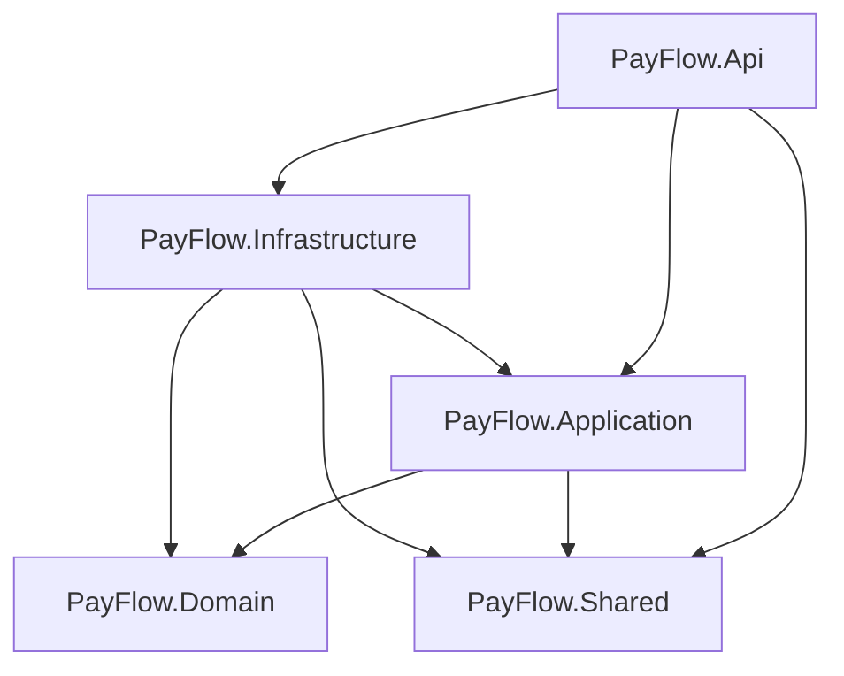
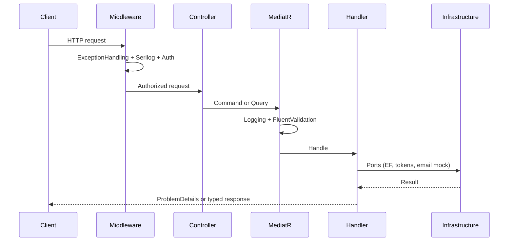
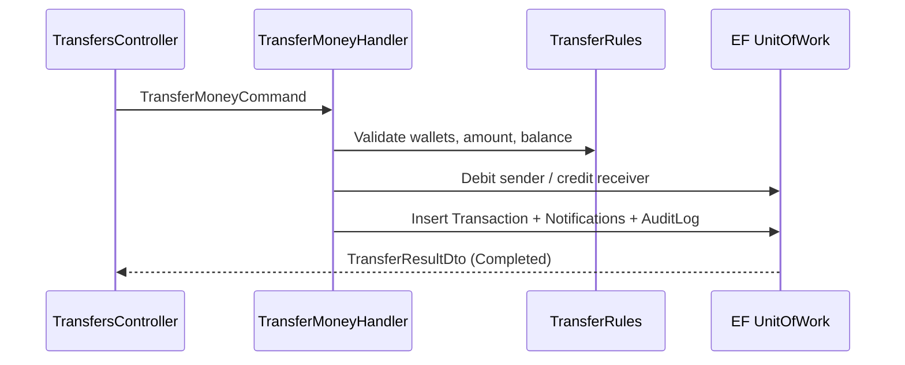

# Architecture overview

PayFlow follows **Clean Architecture** with **CQRS** for application use cases.

## Layers

| Project | Responsibility | May depend on |
|---|---|---|
| `PayFlow.Domain` | Entities, enums, domain invariants | — |
| `PayFlow.Application` | Commands, queries, validators, ports (interfaces) | Domain, Shared |
| `PayFlow.Infrastructure` | EF Core, SQL Server, token store, email mock | Application, Domain, Shared |
| `PayFlow.Api` | HTTP, auth middleware, DI composition, ProblemDetails | Application, Infrastructure, Shared |
| `PayFlow.Shared` | Cross-cutting primitives only | — |



Dependency rule: **Domain has zero project references.** Application never references EF Core.

## Request flow



### Pipeline (detail)

```text
HTTP Request
  → ExceptionHandlingMiddleware (ProblemDetails + structured logs)
  → Serilog request logging (method/path/status/elapsed)
  → Authentication / Authorization
  → RequestLogContextMiddleware (TraceId / UserId)
  → Api Controller (map DTO → command/query)
    → MediatR
      → Logging behavior (request name + elapsed; no payloads)
      → Validation behavior (FluentValidation)
      → Handler (Application)
        → Domain rules
        → Ports (interfaces)
          → Infrastructure adapters (EF, etc.)
  → ProblemDetails or typed response
```

## Transfer write path (happy path)



## Why CQRS here

Wallet and transfer systems have asymmetric read/write needs:

- **Writes** need strict validation, atomicity, and side effects (audit, notifications).
- **Reads** need pagination, filtering, and stable DTOs without accidental mutation.

CQRS makes that asymmetry explicit without requiring separate databases (that can come later).

## Controllers stay thin

Controllers should:

- Accept requests
- Send MediatR messages
- Return HTTP results

They should **not**:

- Validate business rules
- Open DbContext
- Contain transfer/ledger logic

## Composition root

`Program.cs` is the only place that knows about *both* Application and Infrastructure registrations:

```csharp
builder.Services.AddApplication();
builder.Services.AddInfrastructure();
```

This keeps feature modules testable and replaceable.
