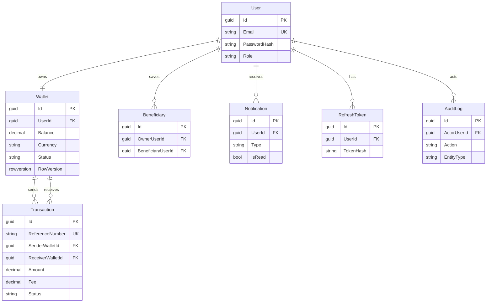

# Persistence design

**Milestone:** 1  
**Status:** Done

## Goals

- Keep Domain free of EF Core attributes and SQL types
- Map the full product schema early (even before all features are implemented)
- Support safe concurrent balance updates later via optimistic concurrency

## Layout

| Piece | Location |
|---|---|
| Entities / enums | `PayFlow.Domain` |
| `PayFlowDbContext` | `PayFlow.Infrastructure/Persistence` |
| Fluent configurations | `PayFlow.Infrastructure/Persistence/Configurations` |
| Migrations | `PayFlow.Infrastructure/Persistence/Migrations` |

## Entity-relationship model

## Key mapping choices

| Choice | Why |
|---|---|
| Fluent API configs (not data annotations) | Keeps Domain persistence-ignorant |
| Enums stored as strings | Readable in SQL / support tooling; avoid magic ints in demos |
| `decimal(18,2)` for money | Standard EF money mapping for this portfolio |
| Unique email / reference number / beneficiary pair | Enforce integrity in the database, not only in app code |
| `RowVersion` on `Wallet` | Prepares transfer engine for concurrent debit safety |
| Refresh token **hash** column | Never persist raw refresh tokens |
| Restrict deletes on wallets/transactions | Protect financial history from accidental cascade wipes |

## Design-time factory

`PayFlowDbContextFactory` lets `dotnet ef` create migrations without booting the full API host.

## Migration strategy

- Migrations live with Infrastructure (source of truth for schema)
- Local Development may auto-migrate on startup for demos
- Production-like environments should apply migrations via CI/CD or an explicit release step

## What is intentionally not here yet

- Repositories / unit of work ports (arrive with feature milestones)
- Seed data (auth milestone can add a demo admin if useful)
- Read replicas / ledger tables (post-MVP)
